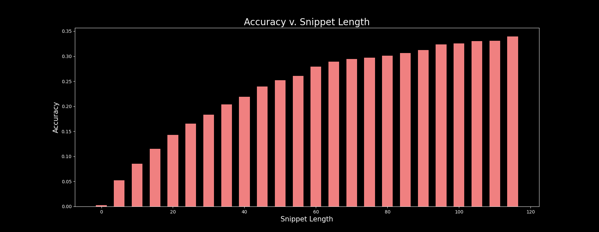
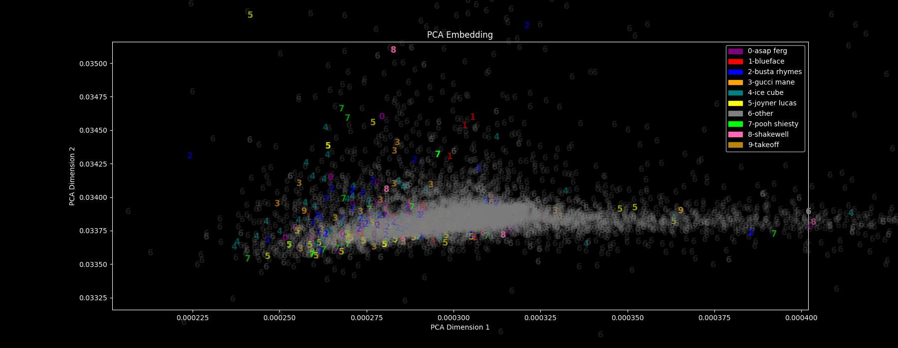

# Music Artist Classifier

### Background

Can a computer tell music artists apart by only looking at their lyrics? Better yet, can it actually predict who would sing a lyric? This project will dive into these questions.
For some aspiring artists out there, this program can be used to tell them what artist they most resemble, lyrically. 

## Data
[]
The dataset contains over 12,000 songs by 336 artists in a wide variety of genres. This model can only get better with more data, so more songs and artists are continuously being added.

1. **Scraping Data**

- To begin collecting song lyrics, I first needed to start with a list of artists. I obtained this list from [ListChallenges](https://www.listchallenges.com/500-random-musical-artists), which was then scraped. With a list of artists, I used the [LastFM API](https://www.last.fm/api) to obtain their 50 most popular songs. For each song, I scraped the lyrics from [AZLyrics](https://www.azlyrics.com/). The lyrics were then cleaned of any stopwords and unwanted characters such as punctuation. This data was then written out into a .txt file in this format: `artist_name|song_name|lyrics`.


## Modeling

One of the biggest obstacles this project faced were memory issues. When dealing with over 12,000 songs, each with hundreds of words, some models simply couldn't handle all of that data. The model of choice was Logisitic Regression using Stochastic Gradient Descent, as it was able to handle a large NLP dataset the best (without exluding any words). These are some of the models that were tried:
  * Random Forests - very, very slow. Wasn't able to complete training after 12 hours of running
  * Random Forests (smaller TFIDF) - significantly lower accuracy that wasn't viable
  * Gradient Boosted Trees - same issue as Random Forests
  * Multinomial Naive Bayes - slow, as well as low accuracy
  * SGDClassifier - was able to use the entire dataset along with ngrams to compute relatively high accuracy in little time

Seeing that the SGDClassifier (which is really just Logistic Regression with Stochastic Gradient Descent as the optimizer) was able to perform the best in almost all areas, it was fairly straightforward that it would be the model of choice.

1. **Model Pipeline**

- In order to train a machine learning model on text, the text must be represented by numbers. We can do this relatively easily using various [SKLearn](https://scikit-learn.org/stable/) objects such as `CountVectorizer` and `TfidfTransformer`. To simplify things even more, the `Pipeline` object was also used. In code, it looks like this:
```python
Pipeline([('vect', CountVectorizer()),
          ('tfidf', TfidfTransformer()),
          ('clf', SGDClassifier()),
         ])
``` 
- `CountVectorizer` builds a matrix that contains rows, where each row represents a sentence. These rows are filled with whole numbers, that represent the count for the corresponding word in the bag of words in that sentence. You can read more about that [here](https://scikit-learn.org/stable/modules/generated/sklearn.feature_extraction.text.CountVectorizer.html)
- `TfidfTransformer` normalizes the values in the `CountVectorizer` matrix. TFIDF stands for 'Term Frequency * Inverse Document Frequency', where each value in a cell corresponds to (frequency of that word in the row) * (frequency of word in that column). This normalizes each value to somewhere between 0-1.

2. **Parameters** 

- Fitting the model as explained above led to decent accuracy, of about 25% (84x better than baseline). However some things needed to change for the use case. In my mind, the purpose of this model is to predict the artist, not from an entire lyric, but from a short snippet that could be quickly typed out. So, each lyric would be blown up into multiple "lyrics" of a smaller length. Of course, the smaller this snippet got the lower the accuracy went.
 

- Some artists also have longer lyrics, so by turning these lyrics into multiple rows, the classes were beginning to be very unbalanced. To combat this, I used the [IMBLearn](https://imbalanced-learn.org/stable/) `RandomOverSampler`.
- To improve the accuracies of these shorter snippets, I also added ngrams to the `CountVectorizer` up to size 4. This drastically improved the accuracy, jumping from 18% to 52%. This accuracy is **175x better** than the baseline.

3. **Unsupervised Learning**

- In measuring accuracy, I also measured the accuracy for each category and I noticed some artists were consistently getting predicted with higher accuracies. My reasoning behind this was that those artists simply used very different semantics to the other artists. This can be visualized with a PCA embedding graph. In the graph below, the artists that were in the top 10 in terms of accuracies are labelled. All other artists are labelled as "other" 


- As you can see, these artists that the model was doing a better job of classifiying are mostly on the outskirts of this cluster, which signifies that these artists do indeed have something much more unique about their semantics than most other artists.


## Results

- As mentioned above, the final SGDClassifier that was used had an accuracy of 52%. This number does not look extraordinary, however our baseline (guessing one artist out of 336), is about 0.29%. This means the model was about 175x better than the baseline when it came to predicting artists. 


## Web App

- One of the most exciting parts about this project was building a web app, where anyone can type in a lyric and the model will predict the artist based on that lyric. You can visit the website at: https://whosaysthat.ngrok.io/


## Outlook

- To continue to improve this model, I will scrape more songs for each artist, as well as scrape more songs from artists that are not yet included in the dataset.
- I would like to try the models that were not usable above on a more powerful computer, with more time just to see how they perform. 
- I would also like to add more machine learning projects that are related to music onto this website, such as song recommendations.


## Technologies Used
- Pandas
- Numpy
- Matplotlib
- Sklearn
- NLTK
- Imblearn
- Heapq
- Pickle
- Re
- Datetime
- Requests
- BeautifulSoup
- JSON
- Flask
- Bootstrap
